# Diapositivas #10 - 14/05/2025

## Diseño: Diagramas de comunicación

### Diagramas de interacción

- UML incluye los **diagramas de interacción** que sirven para mostrar ejemplos de como ciertos objetos interactuan a través de mensajes para la realización de tareas.
- Existen varios **diagramas de interacción** que son semánticamente equivalentes entre sí, en particular:
    - Diagramas de secuencia
    - Diagramas de comunicación
- Veamos un ejemplo:
    - Diagrama de secuencia:
        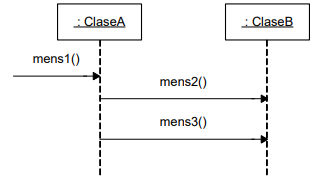
    - Diagrama de comunicación equivalente
        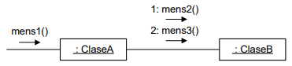

### Notación

#### Instancias

- Las instancias se representan igual que en los diagramas de secuencia.
- Corresponden a una instancia "cualquiera" de una cierta clase o interfaz (no a una instancia real).
    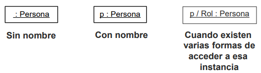

#### Clases

- Las clases se representan con el nombre de la clase dentro de un rectángulo
- Corresponden a una clase no a una instancia.
    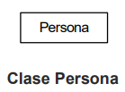

#### Links

- Representa una conexión entre **instancias** que indica navegabilidad y visibilidad entre ellas.
- Establece una relación de cliente/servidor entre las **instancias**.
    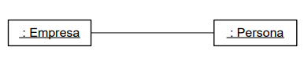

#### Mensajes

- Los mensajes son representados mediante una flecha etiquetada.
- Un mensaje está asociado a un link y tiene asignado un número de secuencia que determina el orden de ocurrencia.
    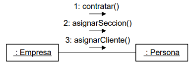

#### Parámetros

- Los parámetros se muestran entre paréntesis a la derecha del nombre del mensaje.
- Se puede además mostrar su tipo.
    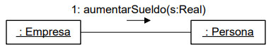

#### Valor de retorno

- El valor de retorno puede ser mostrado a la izquierda del mensaje, con un ":=" en medio.
- Se puede mostrar además el tipo del valor de retorno
    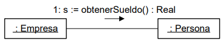

#### Sintáxis de mensajes

- La sintáxis de los mensajes es la siguiente:
    - **[ret :=] mensaje([param[: TipoParam]]) [: TipoRet]**

- Donde:
    - **ret** almacena el resultado de la operación (opcional)
    - **mensaje** es el nombre del mensaje enviado (y de la operación invocada)
    - **param** son argumentos usados en el envío
    - **TipoParam** es el tipo de cada parámetro (opcional)
    - **TipoRet** es el tipo de retorno de la operación (opcional)

#### Iteración

- Las iteraciones se indican mediante un asterísco (*) a continuación del número de secuencia del mensaje.
- Esto expresa que el mensaje es enviado en forma repetida (en un loop) al receptor.
    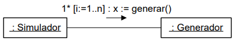

#### Creación de instancias

- La forma de ilustrar la creación de una instancia es enviando el mensaje **create**.
- Este mensaje puede incluir parámetros.
- Lo usual es específicar un nombre para la instancia para poder utilizarla después.
    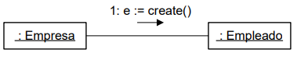

#### Destrucción de instancias

- La forma de ilustrar explícitamente la destrucción de una instancia es enviando el mensaje **destroy**.
- Previamente, debe eliminarse todo link que exista con esa instancia.
    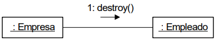

#### Números de secuencia

- El órden de ocurrencia de los mensajes viene dado por los números de secuencia.
- El mensaje que inicia la interacción generalmente no es numerado.
    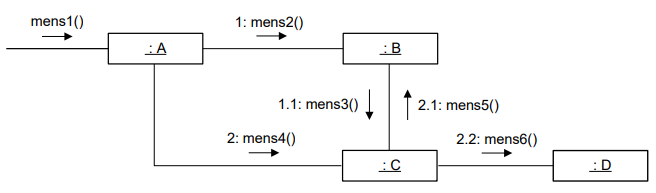

#### Mensajes condicionales

- Un mensaje condicional es enviado únicamente si su condición es satisfecha.
- La condición se muestra entre paréntesis rectos a la izquierda del mensaje.
    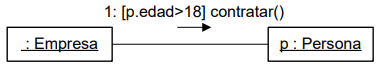

#### Colecciones

- Los multiobjetos de los diagramas de interacción representan una colección de objetos de una cierta clase.
    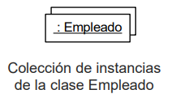

#### Mensajes a colecciones

- Un mensaje a una colección representa un mensaje al objeto colección mismo.
- **NO** un broadcast a todos los elementos contenidos en él.
    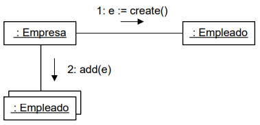

#### Responsabilidad de colecciones

- Las colecciones serán tratadas serán tratadas como meros contenedores de objetos, por lo que no tendrán otra responsabilidad más que esa.
- Proveerán solamente operaciones que permitan administrar los objetos contenidos.
- En general las interfaces de **Diccionario** (add, remove, find, member, etc.) e **Iterador** (next, etc.) son suficientes para las colecciones.
    - **add(o: Tipo) -** Agrega la instancia **o** a la colección
    - **remove(o: Tipo) -** Remueve la instancia **o** de la colección. No elimina la instancia
    - **find(c: Clave):Tipo -** Retorna la instancia con clave **c**
    - **exists(c: Clave):bool -** Devuelve un booleano indicando si la instancia con clave **c** existe o no en la colección
    - **member(o: Tipo):bool -** Devuelve un booleano si la instancia **o** existe o no en la colección
    - **next():Tipo -** Devuelve el próximo elemento en la colección. Se supone que la colección está ordenada.
- Veamos un ejemplo:
    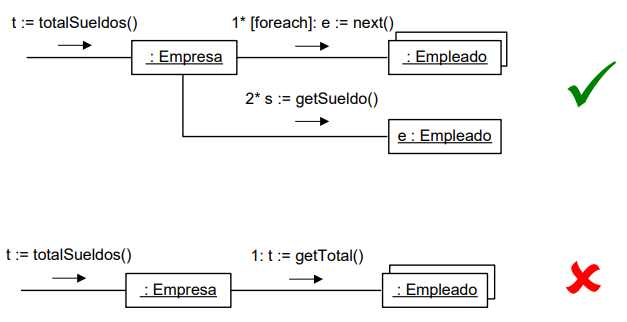

#### Datatypes

- El procesamiento de datatypes (construcción, envío de mensajes) no se muestra gráficamente: se utilizan notas.
    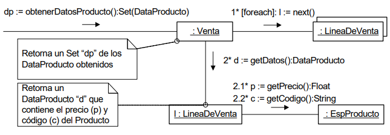
- Es posible iterar sobre los elementos de una colección de datatypes: **forall dt in ColDT**.
    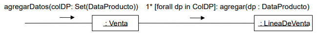
- Es posible acceder a los elementos de un datatype utilizando el operando ".".
    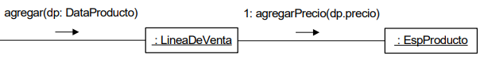

### Reuso de elementos de diseño

- Se busca reutilizar los elementos de diseño generados de una iteración a otra.
    - En particular: clases, operaciones y atributos
- Esto apunta a generar iterativamente el diseño y no "reinventar la rueda" cada vez.
- El diseño debe ser consistente de una iteración a otra. Es decir, si un elemento de diseño cambia, no puede quedar información inconsistente en otra parte del diseño.

### Errores comunes

- Suponer la existencia de links nunca generados.
- Enviar un mensaje a un multiobjeto que implique el procesamiento con todos los objetos contenidos en él.
- No especificar que sucede con mensajes que aparentan ser triviales.
- Representar datatypes como instancias.