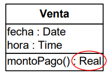
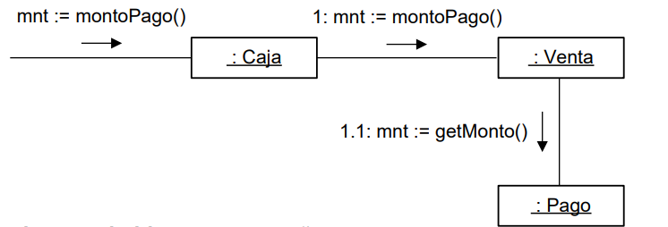

# Diapositivas #11 - 15/05/2025

## Diseño: Criterios de asignación de responsabilidades GRASP

### Introducción

- Un sistema orientado a objetos está compuesto de objetos que envían mensajes a otros objetos para realizar operaciones.
- Para una misma operación es posible diseñar interacciones asignando responsabilidades de diferentes formas.
- La calidad del producto resultante no es la misma en todos los casos.
- Malas elecciones pueden conducir a sistemas que sean frágiles y díficiles de mantener, comprender, reutilizar y extender.
- Existen criterios para la asignación de responsabilidades que nos guían hacia el diseño de una buena solución.
- Estos son los criterios **GRASP**.

### Responsabilidades

- Una responsabilidad es una obligación que un tipo tiene.
- Estas obligaciones son entendidas en términos del comportamiento de los objetos.
- Existen dos tipos básicos de responsabilidades:
    - Responsabilidad de saber o conocer
    - Responsabilidad de hacer

#### Saber o conocer

- Responsabilidades de objetos típicas de esta categoría:
    - Conocer datos privados
    - Conocer a otros objetos
    - Saber cosas que pueda derivar o calcular
- Ejemplo: Una transacción de un cajero automático es reponsable de conocer su fecha de realizada.

#### Hacer

- Responsabilidades de objetos típicas de esta categoría:
    - Hacer algo por sí mismos
    - Iniciar acciones en otros objetos
    - Controlar actividades de otros objetos
- Ejemplo: Una transacción de cajero automático es responsable de imprimirse a sí misma.

#### Responsabilidades y métodos

- Una responsabilidad es típicamente asignada a una clase, siendo instancias de ésta quienes efectivamente deben cumplir con la responsabilidad.
- Para solicitar a una instancia que cumpla con una responsabilidad, es necesario enviarle un mensaje (i.e invocarle una operación).
- Dicha operación suele denominarse como "punto de entrada".
- El método asociado al punto de entrada generará el resultado esperado en función de:
    - El estado del objeto implícito (la responsabilidad se resuelve completamente en el punto de entrada)
    - El trabajo delegado a otros objetos
    - Una combinación de ambos enfoques
- Delegar trabajo a otros objetos significa definir sub-responsabilidades y asignarlas a ellos.
- Esto causa que para resolver la responsabilidad original se deba producir una interacción entre un conjunto de objetos.

#### Diagramas de comunicación

- Los diagramas de comunicación son los artefactos mediantes los cuales se expresarán las interacciones.
- Su propósito es ilustrar la asignación de responsabilidades y sub-responsabilidades.
- Dar una pauta de cómo se debe implementar el punto de entrada.
- Sin embargo NO intenta ser un pseudocódigo para la operación.

### Criterios GRASP

- Los GRASP son criterios que ayudan a resolver el problma de asignar responsabilidades.
- Sugieren:
    1. A quién asignar una responsabilidad cualquiera
    2. A quién asignar algunas responsabilidades particulares
    3. Aspectos a tener en cuenta al asignar una responsabilidad para que la solución presente ciertas cualidades deseables
- **Expert** (Tipo 1): Responsabilizar a quién tenga la información necesaria.
- **Creator** (Tipo 2): A quién responsabilizar de la creación de un objeto.
- **Bajo acoplamiento** (Tipo 3) Evitar con un objeto interactúe con muchos objetos.
- **Alta cohesión** (Tipo 3) Evitar que un objeto haga demasiado trabajo.
- **No hables con extraños** (Tipo 3): Asegurarse que un objeto realmente delega trabajo.
- **Controller** (Tipo 2): A quién responsabilizar de ser el controlador.
- Algunas observaciones sobre los criterios:
    - **Controller** ayuda a asignar la responsabilidad de manejar una operación del sistema
    - **Expert** típicamente ayuda a asignar sub-responsabilidades
    - **Creator** aplica cuando una responsabilidad implica crear un objeto
    - El resto se tiene en cuenta en todo momento
        - Típicamente para elegir la "preferible" entre diferentes alternativas
- Veamos con más detenimiento cada uno de los criterios.

#### Controller

- Sugerencia 1: Asignar la responsabilidad de manejar las operaciones del sistema a una clase que represente una de las siguientes opciones:
    - La organización o el sistema (façade controller)
    - Un manejador artificial de todas las operaciones de un mismo caso de uso (use-case controller)
- Un controlador de tipo Façade provee todas las operaciones del sistema:
    - Existe un único controlador por sistema
    - Recibe el nombre del sistema o de la organización
- Un controlador de casos de uso realiza las operaciones de un solo caso de uso:
    - Existen tantos controladores como casos de uso
    - Reciben el nombre de XXController siendo XX el caso de uso asociado
- Ejemplo:
    - ¿Quién debe ser el responsable de manejar un evento del sistema como "ingresarItem"?
    - Según **controller** estas serían las opciones:
        - Caja - Façade controller (representa al sistema)
        - Supermercado - Façade controller (representa a la organización)
        - ProcesarVentaController - use-case controller (representa un manejador artificial para el caso de uso considerado)
- Sugerencia 2: Utilizar el mismo controlador para manejar las operaciones del sistema de un mismo caso de uso.
    - Esto es para poder mantener dentro de un mismo controlador el estado de la sesión
    - De otra forma el estado quedaría distribuido en diferentes controladores
- Discusión: ¿En qué casos conviene elegir uno u otro tipo de controlador?
    - Un error muy común al diseñar controladores es asignarles demasiadas responsabilidades
    - En este tipo de casos el controlador presentaría una baja cohesión y además un alto acoplamiento
    - Un controlador debería delegar trabajo a otros objetos mientras él coordina la actividad
    - Los controladores façade son adecuados cuando se tienen pocos casos de uso y una poca cantidad de operaciones del sistema en cada uno
    - Un controlador façade puede verse desbordado de responsabilidades si manejase muchas operaciones del sistema de muchos casos de uso
    - Cuando se tienen muchos casos de uso con muchas operaciones es conveniente optar por controladores de casos de uso
    - Cada controlador manejaría las operaciones del caso de uso correspondiente, manteniendo alta su cohesión
    - Una desventaja que presenta este enfoque es que si la cantidad de casos de uso es muy grande, entonces la cantidad de controladores también lo será

    

#### Expert

- Sugerencia: Asignar una responsabilidad al experto en información: la clase que tiene o conoce la información necesaria para cumplir con la responsabilidad.
- Por ejemplo en el siguiente caso, quién tiene la responsabilidad de conocer el total de una venta?
    
- Para asignar esa responsabilidad hay que determinar que información se requiere.
    - El subtotal de cada línea de la venta
- Esta información solo puede ser obtenida por la venta pues es quién conoce cada línea.
    - La clase Venta es la experta en conocer el total
- Esto genera otro problema de asignación de responsabilidades:
    - ¿Quién es el responsable de conocer el subtotal de una línea de venta?
- Para asignar esa nueva responsabilidad hay que determinar que información se requiere.
    - La cantidad de productos y el precio unitario
- Esta información solo puede ser obtenida por la linea de venta pues es quien conoce la cantidad y la especificación del producto.
    - La clase LineaDeVenta es la experta en conocer el subtotal
- Esto genera otro problema de asignación:
    - ¿Quién es el responsable de conocer el precio unitario?
- Esta información solo puede ser obtenida por la especificación del producto pues tiene ese dato como atributo.
    - La clase EspProducto es la experta en conocer el precio unitario
- Esta asignación se ilustra en un diagrama:
    
- La estructura necesaria para esta interacción sería:
    

#### Creator

- Sugerencia: Asignar a la clase B la responsabilidad de crear una instancia de la clase A en uno de los siguientes casos:
    - A está agregado en B
    - A está contenido en B
    - B registra instancias de A
    - B utiliza objetos de A en forma "exclusiva"
    - B es experto en crear instancias de A
- Crear instancias es una de las acciones más comunes en un sistema orientado a objetos.
- Es de utilidad disponer de un criterio general para la asignación de responsabilidad de crear instancias.
- Realizándose en buenas formas el diseño adquiere buenas cualidades como el bajo acoplamiento.
- Ejemplo:
    - ¿Quién es el responsable de crear instancias de LineaDeVenta?
    - Por creator, se decide que la clase Venta es responsable de crear instancias de LineaDeVenta
    

#### Bajo acoplamiento

- Sugerencia: Asignar responsabilidades de forma tal que el acoplamiento se mantenga bajo.
- El **acoplamiento** es una medida de
    - Que tanto una clase está relacionada
    - Tiene conocimiento de
    - O depende de otras clases
- Una clase con bajo acoplamiento depende de pocas clases.
- En cambio una con alto acoplamiento depende de muchas clases.
- Una clase de alto acoplamiento no es deseable ya que presenta los siguientes problemas:
    - Cambios en las clases de las que se depende fuerzan cambios locales
    - Es díficil de comprender de forma aislada
    - Es díficil de reutilizar ya que requiere de la presencia de las clases de las que depende
- Formas comunes de acoplamiento entre elementos X e Y pueden ser:
    - X tiene un atributo de tipo Y
    - X tiene un método que referencia a una instancia de Y. Esto puede ser porque:
        - Tiene una variable local
        - Tiene un parámetro formal
        - Retorna una instancia de tipo Y
    - X es subclase directa o indirecta de Y
    - Y es una interfaz y X la complementa
- Ejemplo:
    - Se necesita crear un pago y asociarlo con la venta correspondiente
    - ¿Quién es el responsable de esto?
    - La caja registraría los pagos en el mundo real
    - Por Creator la clase Caja es entonces un candidato para ser responsable de los pagos
    - Una asignación de responsabilidades tal produciría la siguiente solución:
        
    - Sin embargo acá se acopla a Caja con Pago y a Venta con Pago (Caja ya estaba acoplada a venta)
    - Ya que la venta está acoplada al pago, por Bajo Acoplamiento podríamos hacer que la Venta cree el Pago, así Caja no estaría acoplada con Pago
        

#### Alta cohesión

- Sugerencia: Asignar responsabilidades de forma que la cohesión general se mantenga alta.
- La **cohesión** es una medida de que tan relacionadas están entre si las reponsabilidades de una clase.
- Una clase altamente cohesiva tiene un conjunto de responsabilidades relacionadas y no realiza una gran cantidad de trabajo.
- Una clase con baja cohesión no es deseable ya que presenta los siguientes problemas:
    - Es díficil de comprender
    - Es díficil de reutilizar
    - Es díficil de mantener
    - Se ve afectada por cambios en fórma constante
- Clases con baja cohesión tomaron demasiadas responsabilidades que pudieron haber delegado a otras clases.
- Ejemplo:
    - Es posible retomar el caso anterior asignando la responsabilidad de crear el Pago a la clase Caja.
    - Considerándose en forma aislada (a parte del problema de acoplamiento) no habría problema en asignar la responsabilidad a la caja.
    - Pero en un contexto más global, si se hace a la caja responsable de más y más operaciones del sistema, resultaría que se encontraría sobrecargada y bajaría su nivel de cohesión.
- En conclusión: una clase de alta cohesión:
    - Tiene un número relativamente pequeño de operaciones (no realiza mucho trabajo)
    - Sus funcionalidades están muy relacionadas
- Clases así son ventajosas ya que son fáciles de mantener, entender y reutilizar.

#### No hables con extraños

- Sugerencia: Asignar responsabilidades de forma tal que un objeto desde un método le envíe mensajes solamente a:
    - Él mismo (this o self)
    - Un parámetro de un método
    - Un atributo de this o self
    - Un objeto contenido en una colección que sea un atributo de this o self
    - Un objeto local
    - Un objeto global
- Lo que busca evitar es que un objeto gane temporablemente visibilidad sobre un objeto "indirecto"
- Un objeto es indirecto respecto a uno dado si:
    - No está conectado directamente a éste
    - Existe un tercer objeto intermediario que esté conectado directamente a ambos
- Ganar visibilidad sobre un objeto indirecto implica:
    - Quedar finalmente acoplado a éste
    - Conocer la estructura interna del objeto intermedio
- Ejemplo:
    - En caso de que la caja deba responder el monto de un pago una solución podría ser la siguiente
        
    - La forma de devolver el monto sería:
        
    - Observemos que en este caso, la caja habla con un objeto indirecto (un extraño)
    - Un enfoque más adecuado sería que la venta devuelva solo la información del pago que la caja necesita en lugar de devolverlo completo.
    - Las clases Caja y Pago quedan sin modificaciones
        
    - Realizada dicha modificación, la forma de devolver el monto sería:
        
    - La caja ya no habla con un extraño
- Este criterio representa una buena sugerencia.
- En algunas situaciones particulares es preferible no tenerlo en cuenta.
- Estos casos corresponden a clases que se encargan de devolver objetos indirectos para que otros ganen visibilidad sobre ellos.
- Estos casos presentan particularidades pero pueden ser considerados como violaciones a "No hables con extraños".

### Acceso a la capa lógica

#### Interfaces del sistema

- Las operaciones del sistema realizadas por los controladores deben ser ofrecidas en interfaces.
- Interfaces que contienen operaciones del sistema se denominan **Interfaces del sistema**.
- Enfoque para interfaces del sistema:
    - Son realizadas por controladores (en la capa lógica)
    - Son utilizadas por habitantes en la capa de presentación
- Propósito de las interfaces del sistema: Quebrar las dependencias entre...
    - Los elementos de la presentación que invocan operaciones del sistema
    - Los controladores de la capa lógica que los implementa
- Usualmente cada controlador realiza una interfaz del sistema (relación 1:1).
    
- El criterio para organizar estas interfaces es el mismo presupuesto por Controller:
    - Una interfaz para todas las operaciones del sistema (façade)
    - Una interfaz por caso de uso
- Cuando se tienen pocas operaciones del sistema por caso de uso, pero existen varios de ellos, puede que sea conveniente optar por una solución intermedia a la propuesta por Controller.
- En este tipo de casos:
    - Definir una interfaz para un controlador façade puede hacer que quede una sola interfaz demasiado grande
    - Definir una interfaz por cada caso de uso para definir controladores de caso de uso puede hacer que queden demasiadas interfaces pequeñas
- La propuesta es:
    - Agrupar casos de uso que estén relacionados entre si temáticamente
    - Definir un controlador façade para cada uno de los grupos de casos de uso
- De esta forma existe un "mini façade" por cada uno de los grupos definido.
- Así las cantidades de interfaces y operaciones del sistema por interfaz se equilibran.
- Ejemplo:
    - Sistema de gestión de la información de un cine
    - Gran cantidad de casos de uso (15 considerados para este ejemplo)
    - Muy pocas operaciones del sistema por caso de uso (menos de 2 en promedio)
    - Alternativas:
        - 1 interfaz façade
        - 15 interfaces de caso de uso
        - interfaces híbridas
    - Una interfaz façade incluiría demasiadas operaciones, apróximadamente 30, por lo que no es la mejor opción.
    - Una interfaz por caso de uso nos genera demasiadas interfaces (15 para ser exacto).
    - La propuesta ideal sería la siguiente:
        

#### Fábricas

- Las interfaces del sistema se definieron como un mecanismo que permite quebrar la dependencia de las clases de presentación hacia los controladores de la capa lógica.
- Pero definir una interfaz no es suficiente para quebrar la dependencia entre dos clases.
- La forma en que una de las clases (invocador) obtiene una referencia a la otra (la que realiza la interfaz) determina si la dependencia se quiebra o no.
- Ejemplo (clase Formulario):

    ```cpp
    class Formulario {
        ISistema i; // pseudoatributo

        Formulario() {
            i = new Controlador();
        }
        // continua
    }
    ```
- Entonces la clase Formulario depende de Controlador.
- El problema es que para inicializar el pseudoatributo de Formulario se menciona explícitamente a la clase Controlador.
- Para solucionar este problema, es necesario encontrar otra forma de inicializar el pseudoatributo con una instancia de Controlador.
- Esa forma alternativa debe evitar que se menciona a la clase Controlador.
- La forma de hacer eso es mediante una fábrica de objetos.
- Una fábrica es un objeto que tiene la responsabilidad de crear instancias que realicen una interfaz determinada.
    - En nuestro caso la fábrica crea instancias que realizan la interfaz ISistema
- El invocador quedará acoplado a la fábrica pero no dependerá del realizador de la interfaz.
- Ejemplo de funcionamiento:
    
- La estructura de esto sería la siguiente:
    
- En caso de existir más interfaces del sistema la misma Fábrica puede encargarse de devolver instancias que las realicen.

#### Instancias del sistema

- ¿Quién tiene la responsabilidad de contener las instancias de un tipo determinado?
- Esta responsabilidad define el punto de acceso a las instancias de cierto tipo.
- Para las instancias temporales (memoria del sistema) la responsabilidad suele ser del controlador.
- Para el resto de las instancias hay otras opciones.
    - Opción 1: Un controlador
        - Se puede asignar si el controlador posee operaciones estrechamente relacionadas con el tipo en cuestión
        - El acceso a las instancias se centraliza en el controlador
        - Suele utilizarse si el controlador es de fachada o si existe una única instancia del controlador
    - Opción 2: Una clase de dominio
        - Se puede agregar si existe una clase del dominio que tiene "propiedad" sobre el tipo en cuestión
        - La responsabilidad suele ser parcial, es decir que cada instancia de la clase del dominio contiene la colección de instancias que "le pertenece" y no el universo de ellas
        - Ejemplo: Un cliente contiene el conjunto de transacciones que le pertenece, no todas las transacciones del sistema
    - Opción 3: Una clase ficticia
        - Se suele asignar cuando las alternativas anteriores no son aceptables o deseables
            - porque varios controladores requieren las instancias y deseo quebrar la dependencia entre ellos
            - porque no encuentro una clase del dominio candidata
            - porque considero adecuado no agregar una nueva responsabilidad a las clases existentes
        - Suele existir una única instancia de esta clase que centraliza el acceso
- Dado que la clase responsable es experta en información del tipo en cuestión, se le puede asignar además la responsabilidad de hacer lo que se requiera con ese tipo.
    - Crear y destruir instancias
    - Consultar información de ellas
    - Acceder a instancias de otro tipo relacionadas con ellas
    - Realizar operaciones complejas que involucren estas instancias