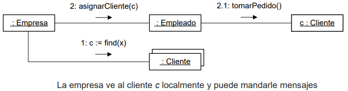

# Diapositivas #12 - 16/05/2025

## Diseño: Visibilidad

### Introducción

- Los diagramas de comunicación ilustran el envío de mensajes entre objetos.
- Para que un objeto pueda enviar un mensaje a otro, el primero debe tener visibilidad sobre el segundo.
- En lo siguiente, se definirán distintos tipos de visibilidad aplicables en UML y su notación.

### Visibilidad

- La visibilidad es la capacidad de un objeto de tener una referencia a otro.
- Existen cuatro formas básicas de que un objeto A tenga visibilidad sobre otro B:
    - **Por atributo:** B es un pseudoatributo de A
    - **Por parámetro:** B es un parámetro de un método de A
    - **Local:** B es declarado localmente en un método de A
    - **Global:** B es visible en forma global
- Expandamos sobre los cuatro tipos.

#### Visibilidad por atributo

- Si existe esta visibilidad entre A y B, entonces B es un pseudoatributo de A.
- Es una visibilidad permamente, ya que existe mientras A y B existan.
- Es el tipo de visibilidad más común en sistemas orientados a objetos.
- Ejemplo:
    

#### Visibilidad por parámetro

- Si existe esta visibilidad entre A y B entonces B fue recibido como parámetro en un método de A.
- Es una visibilidad temporal ya que existe solamente en el alcance del método.
- Es el segundo tipo de visibilidad más común en sistemas orientados a objetos.
    

#### Visibilidad local

- Si existe esta visibilidad entre A y B entonces B fue declarado como un objeto local en un método de A.
- También es una visibilidad temporal ya que existe en el alcance del método.
- Es el tercer tipo de visibilidad más común.
- Formas de obtener este tipo de visibilidad:
    - Crear una instancia localmente y asignarla en una variable local
    - Ejemplo:
        
    - Donde la empresa ve al empleado "e" localmente y puede mandarle mensajes
- Formas de obtener este tipo de visibilidad:
    - Asignar el objeto devuelto por un método a una variable local
    - Ejemplo:
        

#### Visibilidad global

- Si existe esta visibilidad entre A y B entonces B es global a A.
- Es una visibilidad relativamente permanente ya que existe mientras A y B existan.
- Es la forma menos común de visibilidad.
- La forma más obvia de lograr esta visibilidad es asignar una instancia a una variable global.
- Otra forma de obtenerla es mediante el patrón *Singleton*

### Visibilidad en UML

- En UML es posible indicar el tipo de visibilidad gracias a la cual un mensaje es enviado.
    