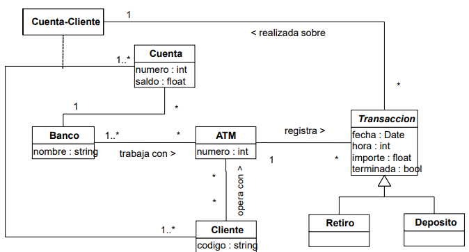
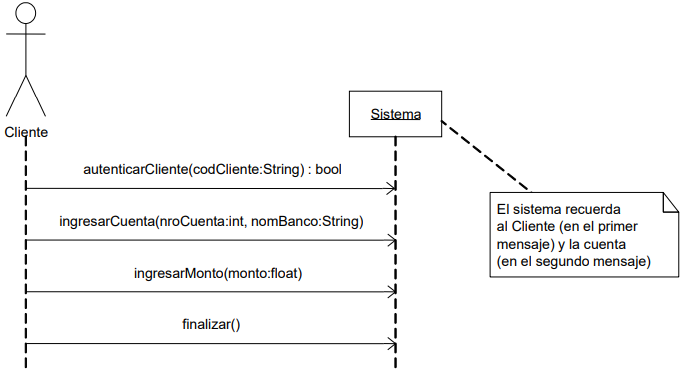
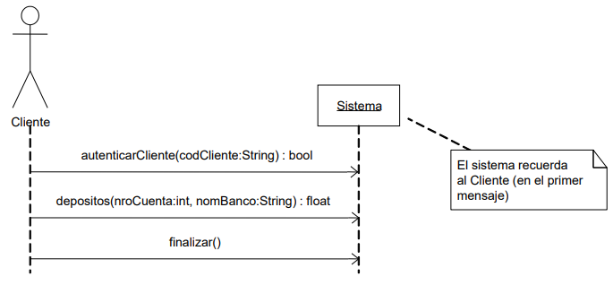
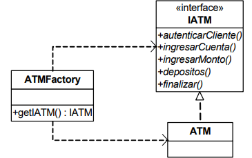
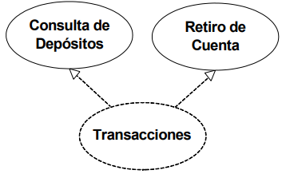
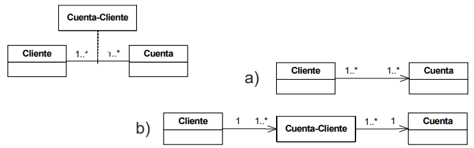

# Diapositivas #13 - 26/05/2025

## Diseño: guías para el abordaje de esta etapa

### Introducción

- Se desea abordar la etapa de diseño con un enfoque sistemático.
- Se presentarán pautas para organizar de mejor forma la tarea.
- Se ejemplificarán las mismas por medio de un caso de estudio.

### Caso de estudio

- Gestión de cuentas de bancos a través de ATMs (cajeros automáticos):
    - A través de una red de ATMs, los clientes acceden a sus cuentas sobre las cuales realizan transacciones (depósitos y retiros)
    - Las cuentas pueden ser compartidas por más de un cliente.

#### Modelo de dominio

#### Caso de uso #1

- **Sinópsis:** El caso de uso comienza cuando el cliente inserta su tarjeta en el cajero e ingresa su clave de usuario. Tras validar al cliente, el sistema recibe el nombre del banco y el número de cuenta para iniciar la transacción de retiro correspondiente. El cliente ingresa el monto que desea retirar de la cuenta y el sistema realiza el débito. Finalmente, el cliente retira su tarjeta.

##### DSS con memoria

##### Operaciones

- **autenticarCliente(codCliente:string):bool**
    - Valida la existencia del cliente

- **ingresarCuenta(nroCuenta:int,nomBanco:string)**
    - Obtiene la cuenta **nroCuenta** del banco **nomBanco** sobre la cual se realizará la transacción.
- **ingresarMonto(monto:float)**
    - Realizar la transacción de débito por el monto indicado sobre la cuenta del cliente.
- **finalizar()**
    - Finalizar la operativa del sistema.

#### Caso de uso #2

- **Sinópsis:** El caso de uso comienza cuando el cliente inserta su tarjeta en el cajero e ingresa su clave de usuario. Tras ingresar los datos de validación (igual que en el caso de uso Retiro de Cuenta), el cliente indica el nombre del banco y el número de cuenta sobre la cual desea consultar el total de depósitos (históricos). Posteriormente, el sistema calcula el total de depósitos histórico y lo devuelve. Finalmente, el cliente retira su tarjeta.

##### DSS con memoria

##### Operaciones

- **autenticarCliente(codCliente:string):bool**
    - Valida la existencia del cliente
- **depositos(nroCuenta:int, nomBanco:String):float**
    - Devuelve la suma de los montos de todos los depósitos realizados en la cuenta **nroCuenta** del banco **nomBanco**
- **finalizar()**
    - Finalizar la operativa del sistema.

### Guías para el abordaje del diseño

- El abordaje de la etapa de diseño puede realizarse sistemáticamente.
- Por ejemplo, considerando estos pasos:
    1. Organizar operaciones
    2. Definir ubicación de instancias
    3. Definir colaboraciones
    4. Diseñar colaboraciones

#### Organizar operaciones

- Definir los controladores a utilizar.
- Definir las interfaces del sistema que contendrán las operaciones del sistema.
- Organizar operaciones según:
    - Afinidad temática (según dominio)
    - Afinidad funcional (según objetivos)
    - Casos de uso
- Definir la fábrica de controladores.
- Al definir controladores, considerar:
    - Operaciones repetidas en casos de uso
    - Memoria del sistema
- Si un controlador realiza una interfaz del sistema, asigna un método a todas las operaciones presentes en ella.

##### Ejemplo

- Algún concepto del dominio podría ser un controlador? ATM, Banco?
- Una posible opción es la siguiente:

    

#### Definir ubicación de instancias

- Diferenciar:
    - Las colecciones que pueden ser alojadas en un controlador (ej: ATM, Banco)
    - Las que serán accedidas únicamente a través de otra clase (ej: Cuenta accesible a través de un Banco)
    - En caso de ser necesario, alojar separadamente una colección que sea compartida entre varios controladores

#### Definir colaboraciones

- Una colaboración realiza uno o más casos de uso.
- Agrupar casos de uso con una cierta afinidad.
    - Comúnmente afinidad temática pero no hay una regla estricta
- Definir una colaboración por cada grupo de casos de uso, asignándole un nombre.
- Priorizar las colaboraciones según el impacto esperado sobre el diseño.

##### Ejemplo

- Definir una sola colaboración para ambos casos de uso es beneficioso ya que están relacionados:
    

#### Diseñar colaboraciones

- Diseñar colaboraciones en orden de prioridad:
    - Realizar diagramas de comunicación para las operaciones del sistema involucradas
    - Considerar (a) criterios de asignación de responsabilidades, (b) decisiones tomadas en iteraciones anteriores (consistencia) y (c) nuevos problemas de diseño
    - Realizar el diagrama de clases de diseño

##### Ejemplo

- Cómo se asignan las responsabilidades?
    - Quién crea las transacciones?
        - ATM? Banco? Cuenta?
    - Quién es el experto en calcular el total de depósitos realizados?
        - Banco? Cuenta? Cliente?
    - Qué visibilidades se necesitan?
        - ATM a Transaccion? Banco a Cuenta? Cliente a Transaccion? ATM a Cuenta?
- Qué sucede con los tipos asociativos?
    - Si poseen información relevante puede convenir mantenerlas

    