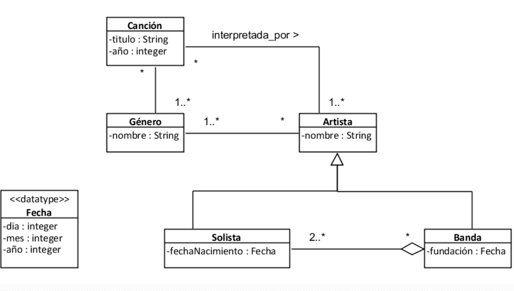
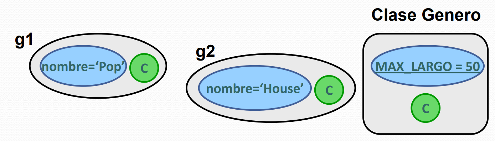
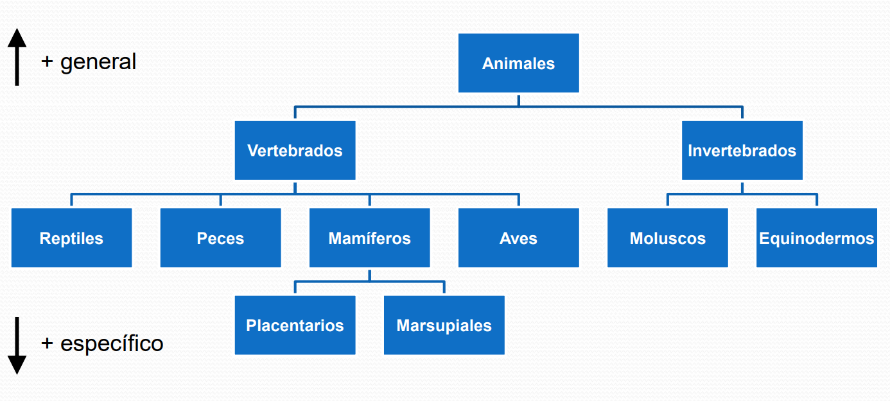
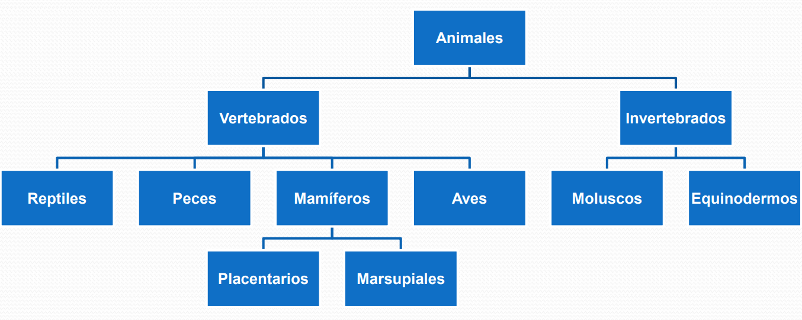
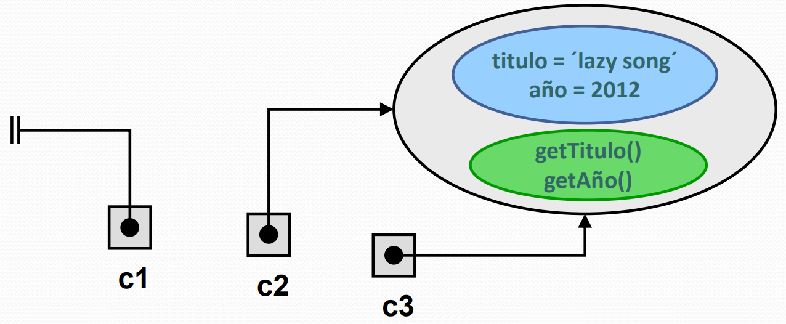

# Diapositivas #3 - 17/03/2025

## Conceptos básicos de orientación a objetos

### Caso de estudio

Para familiarizarnos con los conceptos, usaremos un ejemplo para poder hacer referencia a él a la hora de introducir nuevas ideas.

- Caso: Usuario crea canciones en su biblioteca de música.
- Responsabilidad: Crear la canción en la biblioteca y asociarla correctamente con el resto de los géneros y artistas correspondientes.

Veamos un UML que representa un diagrama de clases del problema al que nos vamos a enfrentar:



### Objeto

Un objeto es una entidad disreta y con límites bien definidos, encapsula **estado** y **comportamiento**. Es una instancia de una clase.

#### Identidad

- La identidad es una propiedad inherente de los objetos de ser distinguible de todos los demás.
- Dos objetos son distintos aunque tengan exactamente los mismos valores en sus propiedades.
- Conceptualmente un objeto no necesita de ningún mecanismo para identificarse.
- La identidad puede ser realizada mediante direcciones de memoria o claves (pero formando parte de la infraestructura subyacente de los lenguajes).

#### Clase

- Una clase es un descriptor de objetos que comparten los mismos atributos, operaciones, métodos, relaciones y comportamiento
- Representa un concepto en el sistema que se está modelando
- Dependiendo del modelo en el que aparezca, puede ser un concepto del mundo real (modelo de análisis) o puede ser una entidad de software (modelo de diseño)

Veamos como se ve implementado en C++:

**DEFINICIÓN**

```cpp
class Cancion {
    ... // definicion de los atributos

    ... // operaciones
}
```

**INSTANCIA (OBJETO)**

```cpp
Cancion *c = new Cancion();
delete c;
```

Para crear un objeto se define un **CONSTRUCTOR**:

```cpp
// por defecto (sin parámetros)
Cancion::Cancion ()
// común (con parámetros)
Cancion::Cancion(string titulo, int anio)
// por copia
Cancion::Cancion(Cancion &)
```

Para destruir un objeto se define un **DESTRUCTOR**:

```cpp
Cancion::~Cancion();
```

#### Atributo

Es una descripción de un compartimento de un tipo especificado dentro de una clase. Puede ser:

- **De instancia:** Cada objeto de esa clase mantiene un valor de ese tipo de forma independiente.
- **De clase:** Todos los objetos de esa clase comparten un mismo valor de ese tipo.

Veamos un ejemplo de la implementación en C++:

```cpp
class Genero {
    private:
        string nombre; // Atributo de instancia
        static string MAX_LARGO; // Atributo de clase
}
```

Gráficamente:



#### Operación

Es una especificación de una transformación o consulta que un objeto puede ser llamado a ejecutar. Tiene asociados un nombre, una lista de parámetros y un tipo de retorno.

#### Método

Es la implementación de una operación para una determinada clase. Especifica el algorítmo o procedimiento que genera el resultado o efecto de la operación.

Veamos como utilizamos/implementamos estos conceptos en C++:

```cpp
class Genero {
    private:
        string nombre;
    public:
        string getNombre(); // operación
}

string Genero::getNombre() {
    return "El genero es: " + nombre;
}
```

#### Estado

El estado de una instancia almacena los efectos de las operaciones. Está implementado por:
- Su conjunto de atributos.
- Su conjunto de links.

Este mismo está dado por el valor de todos sus atributos y links de un objeto en un momento dado.

#### Comportamiento

Es el efecto observable de una operación, incluyendo su resultado.

#### Acceso a propiedades

Las propiedades de una clase tienen aplicadas calificadores de acceso. En C++ una propiedad de objeto clasificada con:

- **public**: puede ser accedida desde cualquier punto desde el cual se tenga visibilidad del objeto.
- **private**: puede ser accedida solamente desde los métodos de la propia clase
- **protected**: en C++ permite visibilidad a la clase y su derivada

Otros lenguajes pueden definir otros tipos de acceso.

Los atributos deberían ser privados, mientras que las operaciones deberían ser públicos:

```cpp
class Genero {
    private:
        string nombre;
    public:
        string getNombre(); // operación
}

string Genero::getNombre() {
    return "El genero es: " + nombre;
}

Genero *g = ...;

// código no válido fuera de la clase
g->nombre;
// código válido fuera de la clase
g->getNombre();
```

#### Data type

Es un descriptor de un conjunto de valores que carecen de identidad (esto último es importante). Los data types pueden ser tipos predefinidos como **Strings**, **Números**, **Fecha**. También tipos definidos por el usuario, como enumerados.
Muchos lenguajes no tienen una construcción específica para data types, en esos casos se implementan como clases, donde sus instancias serían formalmente objetos.
Veamos un ejemplo:

```cpp
class Complejo {
    private:
        float i, j;
    public:
        Complejo (int i, int j);
        Complejo operator+ (Complejo &);
    // ... ...
};

Complejo operator -(Complejo i, Complejo d);
```

#### Data value

- Es un valor único que carece de una identidad, es una instancia de un data type.
- Un data type no puede cambiar su estado: eso quiere decir que todas las operaciones aplicables son "funciones puras" (sin efectos secundarios) o consultas.
- Los data values son usados típicamente como valores de atributos.

### Relaciones

#### Asociación

- Una asociación describe una relación semántica entre clasificadores (clases o data types).
- Las instancias de una asociación (denominados links) son el conjunto de t-uplas que relacionan las instancias de dichos clasificadores.
- Cada t-upla puede aparecer como máximo una sola vez en el conjunto.
- Una asociación entre clases indica que es posible "conectar" entre sí instancias de dichas clases.
- Cuando se desea poder conectar objetos de ciertas clases, éstas deben estar relacionadas por una asociación.

#### Link

- Es una t-upla de referencias a instancias (objetos o data values).
- Es una instancia de una asociación.
- Permite visibilidad entre todas las instancias participantes.

#### Representación de asociaciones

Como casi ningún lenguaje permite construcciones específicas para implementar asociaciones, lo hacemos mediante lo que definimos como "pseudoatributos" en las clases involucradas. De esta forma, un "link" no resulta implementado exactamente igual a su representación conceptual.

- Una t-upla es dividida, con un componente ubicado en el objeto referenciado por el otro componente de la t-upla.

**INSERTAR IMAGENES DE LA REPRESENTACIÓN CONCEPTUAL VS LA IMPLEMENTACIÓN**

Veamos un ejemplo de implementación:

```cpp
class Genero {
    private:
        string nombre; // atributo
        Vector<Cancion> canciones; // pseudoatributo
}
```

Observemos que:

- El tipo de un pseudoatributo suele ser una clase, mientras que el tipo de un atributo DEBE ser un Data Type
- Por cuestiones de costo, si una de las visibilidades no es necesaria, usualmente no se implementa (por ejemplo: quizás en este caso Cancion no tenga un pseudoatributo con el género de la misma)

#### Generalización

- Una generalización es una relación taxonómica entre un elemento (clase, data type, interfaz) más general, y un elemento más específico.
- El elemento más específico es consistente (tiene todas sus propiedades y relaciones) con el más general, y puede contener información adicional.

Veamos un ejemplo de taxonomía:



#### Clase base y clase derivada

- Cuando dos clases están relacionadas según una generalización, a la clase más general se la denomina "clase base" y la más específica "clase derivada" de la más general.
- A una clase base se la denomina también "superclase" o "padre"
- A una clase derivada se la denomina también "subclase" o "hijo"
- Una clase puede tener cualquier cantidad de clases base, y también cualquier cantidad de clases derivadas.

```cpp
class Artista {
...
};
class Solista: public Artista {
...
};
class Banda: public Artista{
...
};
```

#### Ancestros y descendientes

- Los ancestros de una clase son sus padres (si existen), y los ancestros de éstos (si existen).
- Los descendientes de una clase son sus hijos (si existen), y los descendientes de éstos (si existen)
- Una clase es clase base directa de sus hijos, y una clase es clase derivada directa de sus padres.
- Una clase es clase base indirecta de los descendientes de sus hijos, y una clase es clase derivada indirecta de los ancestros de sus padres.

Veamos un ejemplo:



- Ancestros de marsupiales son: {mamíferos, vertebrados, animales}
- Descendientes de invertebrados son: {moluscos, equinodermos}
- Aves es clase derivada directa de vertebrados e indirecta de animales
- Vertebrados es clase base directa de mamíferos e indirecta de marsupiales

#### Herencia

Es el mecanismo por el cual se permite compartir propiedades entre una clase y sus descendientes.

- Si una clase no tienen ningún padre entonces sus propiedades son las definidas en la misma clase.
- Si tiene padre, entonces sus propiedades son la unión de las propias, junto con las de su padre.
- Se dice que una clase **hereda** las propiedades específicadas por sus ancestros.
- Entonces los atributos y operaciones de una clase son los que declara más los de su clase base.
- Se puede decir que una clase derivada extiende a su clase base

Veamos un ejemplo implementado en C++:

```cpp
class Artista {
private: string nombre;
    public: string getNombre();
};
string Artista::getNombre(){
    return nombre;
}
class Solista: public Artista {
    public: string toString();
};
string Solista::toString (){
    return "Solista: nombre=" + getNombre();
}
```

#### Polimorfismo

Es la capacidad de asociar diferentes métodos a la misma operación

#### Redefinición de operaciones

Cuando en una jerarquía de generalizaciones se encuentra más de un método asociado a la misma operación, se dice que esa operación está redefinida.
Para una clase determinada, el método asociado a dicha operación será aquel que se encuentre más próximo en su jerarquía.

Veamos un ejemplo implementado en C++:

```cpp
class Artista {
    private: string nombre;
    public: virtual string toString();
};
string Artista::toString(){
    return nombre;
}
class Banda: public Artista {
    private: Fecha *fundacion;
    public: virtual string toString();
};
string Banda::toString(){
    return "Banda ->" + Artista::toString();
}
```

- Para la clase Banda, el método asociado a la operación toString() es el de la clase Banda, no el definido en la clase Artista.
- El método heredado puede ser referenciado en la clase Banda usando su firma completa (Artista::toString())

#### Sobrecarga

Es la capacidad que tiene un lenguaje de permitir que varias operaciones tengan el mismo nombre sintáctico, pero recibiendo diferente cantidad/tipo de parámetros. Veamos ejemplos de sobrecarga:

```cpp
string Banda::toString()
String Banda::toString(bool conFundacion)
```

La sobrecarga no es un concepto exclusivo de orientación a objetos.

#### Operaciones abstractas

En una clase, una operación es abstracta si no tiene un método asociado.

- Tener una operación abstracta es una condición suficiente para que una clase sea considerada abstracta.
- Aún así, una clase puede ser abstracta aún sin tener operaciones abstractas.

Veamos un ejemplo implementado en C++:

```cpp
class Numero {
// operación sin método (abstracta)
    public: virtual float tofloat() = 0;
};
class Racional : public Numero {
    private: int numerador, denominador;
    public: float toFloat ();
};
float Racional::toFloat(){
    if(denominador == 0) return NAN;
    else return numerador / (float) denominador;
}
class Entero: public Numero {
    private: int valor;
    public: float toFloat ();
}
float Entero::toFloat(){
    return (float) valor;
}
```

#### Clase abstracta

Algunas clases pueden ser abstractas, estas tienen la particularidad de que:

- Ningún objeto puede ser creado directamente a partir de ellas.
- No son instanciables

Estas existen solamente para que otras clases hereden las propiedades declaradas por ellas. Un ejemplo de esto podía ser la clase Numero definida en el ejemplo anterior.

Otro ejemplo implementado en C++ podría ser:

```cpp
class Lista {
    public:
        virtual int tamanio() = 0;
        virtual string getElemento(int idx) = 0;
};
class Arreglo {
    private:
        int tam;
        string *elementos;
    public:
        int tamanio();
        string getElemento(int idx);
};
int Arreglo::tamanio(){
    return tam;
}
string Arreglo::getElemento(int idx){
    return elementos[idx];
}
```

Donde Lista es la clase abstracta. En este ejemplo, toda instancia concreta de Lista es un Arreglo

### Despacho

#### Subclassing

Se define la relación entre clases:

(<:) contenido en (Clase x Clase) donde,
B <: A sii B es clase derivada de A

**OBSERVACIÓN:** La relación <: define un orden parcial entre clases

#### Subsumption

- Es una propiedad que deben cumplir todos los objetos, también conocida como intercambiabilidad.
- Un objeto de clase base puede ser sustituido por un objeto de clase derivada (directa o indirecta)
- Por lo tanto: Si b es un objeto de clase B, y B <: A; entonces b también es de clase A
- Esto último se puede leer como: "un objeto instancia de una clase derivada, también es instancia de cualquier clase base"

#### Instancia directa e Indirecta

- Si un objeto es creado para una cierta clase C, entonces decimos que es una instancia directa de C
- Además decimos que el objeto es instancia indirecta de todos los ancestros de C
- Ejemplo:
    ```cpp
    Arreglo *a = new Arreglo();
    ```
    - a es instancia directa de Arreglo
    - a es instancia indirecta de Lista (y sus ancestros, si los tiene)

#### Invocación

- Una invocación se produce al acceder a una propiedad de una instancia que sea una operación.
- El resultado es la ejecución del método que la clase de dicha instancia le asocia a la operación accedida (despacho)

#### Despacho

- Con la introducción del concepto de Subsumption es necesario reexaminar el significado de la invocación de operaciones
- Suponiendo b: B y B <: A es necesario determinar el significado de b.f() cuando B y A asocian métodos diferentes a la operacion f()
- Por tratarse de b: B resultaría natural que el método despachado por la invocación sea el de la clase B.
- Sin embargo por Subsumption sabemos que b: A también. Entonces podría ser que el método a despachar sea el de la clase A.
- En este tipo de casos lo deseable es que el método a despachar sea siempre el asociado a la clase del cual el objeto al que se le aplica la operación es instancia directa. (B en el ejemplo anterior)
- Siempre que es posible el despacho es realizado en tiempo de compilación, esto se denomina despacho estático.

#### Referencia

Una referencia es un valor en tiempo de ejecución que es **void** o **attached**.

- Si es attached indica que la referencia identifica a un único objeto (se dice que la referencia está adjunta a ese objeto particular).
- Si es void la referencia no identifica a ningún objeto.

Veamos un ejemplo implementado en C++:

```cpp
    Cancion *c1 = null; // void
    Cancion *c2 = new Cancion(´lazy song´, 2012); // attached
    Cancion *c3 = *c2; // attached
```

Gráficamente:



#### Tipo estático y tipo dinámico

- El tipo estático de un objeto es el tipo del cual fue declarada la referencia adjunta a él:
    - Se conoce en tiempo de compilación
- El tipo dinámico de un objeto es el tipo del cual es instancia directa.
- En ciertas situaciones, ambos tipos coinciden, por lo que pierde el sentido realizar tal distinción.
- En situaciones especiales, el tipo dinámico difiere del tipo estático y se conoce en tiempo de ejecución.
- Este tipo de situación es en la que la referencia del objeto es declarada como de una clase ancestra del tipo del objeto (lo cual es permitido por subsumption)
- Se cumple esta relación entre los tipos de los objetos:
    - TipoDinamico(obj) <: Tipo Estático(obj)

Veamos un ejemplo implementado en C++:

```cpp
Numero *x = new Racional(1,2);
// TipoEstatico(x) = Numero
// TipoDinamico(x) = Racional
```

#### Despacho dinámico

- Los lenguajes de programación orientados a objetos permiten que el tipo dinámico de un objeto difiera del tipo estático.
- Cuando se realiza una invocación a una operación polimórfica (que está redefinida) sobre un objeto, utilizando una referencia a él, declarada como de una de sus clases ancestras, puede no ser correcto hacer el despacho en tiempo de compilación.
- De realizarse en forma estática, se utilizaría para ello la única información disponible en ese momento, la basada en el tipo estático.
- Por lo que se despacharía (eventualmente) el método equivocado:
    - En particular, cuando la operación invocada es abstracta, no hay método que despachar.

Veamos un ejemplo para observar algunos detalles:

```cpp
Numero *x;
if (esRacional)
    x = new Racional(1,3);
else
    x = new Entero(432);
x->toFloat();
```

- La operación toFloat() declarada en Numero es polimórfica porque es redefinida en Entero y en Racional
- Se está invocando una operación polimórfica sobre un objeto (que será de clase Entero o Racional) mediante una referencia declarada como de tipo Numero (clase ancestra de las anteriores)
- En este caso se tienen que despachar o el método definido en Racional (Racional::toFloat()) o el definido en Entero (Entero::toFloat()). Esto según el tipo dinámico que tenga x.
- Para que en este tipo de casos el despacho sea realizado en forma correcta, es necesario esperar a contar con la información del tipo real del objeto, lo que se obtiene en tiempo de ejecución.
- El despacho dinámico es la capacidad de aplicar un método basándose en la información dinámica del objeto y no en la información estática de la referencia a él.

Repasemos el ejemplo:

```cpp
Numero *x;
if (esRacional)
    x = new Racional(1,3);
else
    x = new Entero(432);
x->toFloat();
```

- En tiempo de compilación: al pasar por la invocación del compilador NO despacha método alguno.
- En tiempo de ejecución: al pasar por la invocación el ambiente de ejecución del lenguaje se ocupa de averiguar el tipo dinámico del objeto para saber que método despachar.
- La decisión de que método de despacho emplear para una operación puede estar preestablecida en el propio lenguaje o definida estáticamente en el código fuente.
- En algunos lenguajes de programación el despacho es dinámico para cualquier operación (sea polimórfica o no)
- En otros lenguajes:
    - Las invocaciones a operaciones polimórficas siempre son despachadas dinámicamente.
    - Las invocaciones a operaciones no polimórficas siempre son despachadas estáticamente.

Veamos otro ejemplo:

```cpp
Numero *arr[3];
arr[0] = new Racional(1,2);
arr[1] = new Entero(2);
arr[2] = new Racional(1,4);
float total = 0.0;
for(int i = 0; i < 3; i++){
    total += (arr[i])->toFloat();
}
cout << "El total es" << total;
```

- En este caso el lenguaje despacha dinámicamente el método correcto, devolviendo entonces el valor correcto.
- El despacho dinámico solo se realiza si la operación está definida como virtual.
- Si es así intenta despachar el método definido en el tipo dinámico.
- En caso de que no haya un método allí, busca el primer método que haya en la jerarquía "hacia arriba".

Un ejemplo más:

```cpp
class Natural: public Entero {
// no define float toFloat();
};
Numero *arr[3];
arr[0] = new Racional(1,2);
arr[1] = new Entero(2);
arr[2] = new Natural(3);
arr[0]->toFloat(); // despacha el método de Racional
arr[1]->toFloat(); // despacha el método de Entero
arr[2]->toFloat(); // despacha el método de Entero
```

#### Algorítmo de despacho en C++ (simplificado)

- El compilador busca la operación según el tipo estático.
- Se va directamente a la clase del tipo estático, luego al de su abuelo, y así sucesivamente hasta encontrar la operación que se invoca.

A partir de aquí tenemos dos opciones:

1. Si la operación encontrada **NO** es virtual:
    - Se despacha el método de la clase que no lo declaró (despacho estático)
2. Si la operación encontrada **SI** es virtual:
    - Se va directamente a la clase del tipo dinámico (en tiempo de ejecución) y si no hay un método para esa operación se busca en el padre, abuelo, etc. hasta encontrar una clase que defina un método para la operación.

**Observación:** Una operación es virtual si tiene el calificador virtual en la declaración o si alguna clase base directa o indirecta declara la misma operación con el calificador virtual.