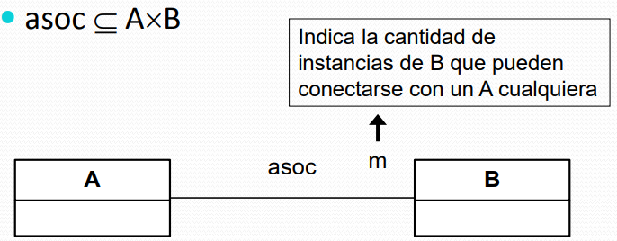

# Diapositivas #5 - 25/03/2025

## Modelado del dominio

### Introducción

- La esencia del análisis orientado a objetos es la descomposición del problema en conceptos individuales.
- Un Modelo de Dominio contiene principalmente los conceptos y sus relaciones que sean significativos en el dominio del problema:
    - Significativos para el modelador.
    - El problema y los requerimientos determinan que es significativo.

### Modelo de dominio

- Está enfocado en conceptos del dominio y no en entidades de software.
- Contenido:
    - **Introducción:** breve descripción que sirve como introducción al modelo.
    - **Conceptos:** clases que representan conceptos significativos presentes en el dominio.
    - **Tipos:** data types que describen propiedades de las clases que representan conceptos.
    - **Relaciones:** relaciones de asociación o generalización entre las clases que representan conceptos.
    - **Restricciones:** expresiones que restringen las posibles instancias de los conceptos del modelo.
    - **Diagramas:** representaciones (usualmente uno solo) de conceptos, tipos y relaciones presentes en el modelo.

#### Conceptos

- Un concepto es una idea, cosa o elemento de la realidad o problema que se está modelando.
- Ejemplo:

    

#### Atributos

- Es necesario identificar aquellos atributos que permitan satisfacer los requerimientos de información.
- Un atributo se extiende como un data value de un objeto.
- El tipo de un atributo es un data type.

##### Notación

- Al mostrar un atributo es necesario especificar al menos su nombre.
- Propiedades opcionales:
    - Tipo, multiplicidad, valor inicial, visibilidad, etc.
    
    
- Alcance de atributos:
    
- Un atributo (o cualquier elemento) que sea derivable se marca con "/".
- Lo usual es adjuntarle una nota especificando la forma en que se calcula.
    

##### Sugerencias

- No utilizar atributos como clave foránea
    - Los atributos no deben ser utilizados para relacionar elementos del modelo.
        

- Tipos primitivos y no primitivos
    - Los tipos de los atributos en general son en general tipos primitivos (int, string, etc.).
    - De ser necesario es posible definir tipos no primitivos para un problema.

#### Conceptos (identificación)

- Es muy común omitir conceptos en esta fase (identificación) que pueden ser descubiertos en una etapa posterior.
    - Al descubrirlos se agregan al modelo de dominio
- Es posible encontrar conceptos que no tengan atributos (que tengan un rol de comportamiento más que de información).
- Comenzar la construcción de un modelo de dominio haciendo una lista de conceptos candidatos.
- Existen dos técnicas para ello:
    - Lista de categorías de conceptos
    - Identificación de sustantivos

##### Lista de categorías de conceptos

- Consiste en repasar la lista de categorías de conceptos buscando los conceptos del dominio del problema que apliquen a cada categoría.

| Categoría  | Ejemplo |
| --------- | ------ |
| Objetos físicos o tangibles | Avión |
| Descripciones de cosas | DescripcionVuelo |
| Lugares | Aeropuerto |
| Transacciones | Reserva |
| Roles | Piloto |

##### Identificación de sustantivos

- Se identifican los sustantivos de una descripción textual del problema (visión del problema y/o casos de uso) y se los considera como conceptos o atributos candidatos.
- No es posible realizar esta actividad en forma totalmente automática.
    - El lenguaje natural es ambiguo
    - No todo sustantivo refiere a un concepto significativo
- Ejemplo: ...Un **cliente** llega a un **punto de venta** a reservar un **pasaje de avión**. El **empleado** hace la **reserva** en el sistema de **aerolínea**...
    - Consideramos los sustantivos en negrita como los candidatos para ser conceptos

#### Conceptos (sugerencias)

- Como crear un modelo de dominio:
    1. Listar los conceptos candidatos usando cualquiera de las dos técnicas presentadas (o una combinación de ambas)
    2. Incluirlos en el modelo de dominio
    3. Agregar las asociaciones necesarias para registrar relaciones que necesiten ser preservadas
    4. Agregar los atributos necesarios para satisfacer los requerimientos de información
- Se sugiere generar y mantener el diagrama en paralelo.
- Para los nombres y el modelado se usa la estrategia del cartógrafo que consiste en:
    - Usar nombres que existan en el territorio
    - Excluir características irrelevantes
    - No incluir cosas inexistentes
- Granularidad de la especificación
    - Durante el proceso de modelado, es mejor sobre-especificar con muchos conceptos de granularidad fina, que sub-especificar
    - El costo de eliminar un concepto que resultó innecesario es menos que el costo de agregar uno que fue omitido
    - Siempre es posible agregar o eliminar conceptos durante el proceso de modelado
- El error más común al crear un modelo de dominio es representar algo como un atributo cuando debió ser un concepto.
    - Si no se piensa en un concepto X básicamente como un número, texto, booleano (o un data type en general), entonces probablemente X no es un atributo.
    - En caso de duda, representarlo como un concepto.
    

##### Ejemplo

Supongamos que tenemos una instancia da "Producto" que representa un producto físico en una tienda:

- Un producto tiene un número de serie, una descrpición, número de serie, un precio y un código, que no aparecen en ninguna parte.
- Los que trabajan en la tienda "no tienen memoria".
- Cada vez que un producto físico es vendido, la correspondiente instancia de "Producto" es eliminada del sistema.
- En el caso de que un producto se agote, nadie podrá saber cuál era el precio de ese producto.
- Ese dato estaba incluido en solamente las instancias que conformaban el inventario.
- Notar que también existe información repetida (por ejemplo el precio).
- Se necesitan conceptos que sean descripciones de otros conceptos.
- En el caso del producto necesitamos una "DescripcionProducto" que registre la información de los productos.
- Estos conceptos no representan los productos, sino información acerca de ellos.
- Si todas las instancias de "Producto" son eliminadas, la "EspecificacionProducto" permanece.

#### Asociaciones

- Es necesario identificar aquellas asociaciones entre conceptos que:
    - Sean necesarias para satisfacer los requerimientos de información
    - Ayuden a la comprensión del Modelo del Dominio
- Una asociación es una relación entre conceptos que indica alguna conexión interesante o significativa entre ellos.
- En general surgen del conocimiento de una relación que debe ser preservada por un cierto tiempo.
- Se distinguen dos categorías de aplicaciones:
    - **De comprensión:** permiten comprender mejor el problema
    - **Need-to-know** permiten satisfacer los requermientos de información
- Veamos una lista de asociaciones diferentes comunes que pueden resultar de utilidad al momento de realizar un modelo de dominio:
    - A es una parte física de B
    - A es una parte lógica de B
    - A está contenido físicamente en B
    - A está contenido lógicamente en B
    - A es un miembro de B
    - A es una descripción de B
    - A es un ítem de una transacción B
    - A es conocido/registrado/capturado en B
    - A es una subunidad organizacional de B
    - A usa o maneja B
    - A se comunica con B
    - A esta relacionado con la transacción B
    - A es una transacción relacionada con la transacción B
    - A está cerca de B
    - A es propiedad de B
- Considerar la inclusión de las siguientes asociaciones:
    - Asociaciones para las que el conocimiento de la relación debe ser preservado por una cierta duración (need-to-know).
    - Asociaciones derivadas de la "lista de asociaciones".
    - De ser necesario incluir asociaciones de comprensión.

#### Asociaciones (sugerencias)

- Concentrarse en identificar conceptos más que asociaciones.
- Evitar mostrar asociaciones derivables o redundantes.
- Demasiadas asociaciones tienden a confundir más que a ilustrar.
- **Ideal:** punto intermedio entre un modelo minimal solo con asociaciones "need-to-know" y un modelo maximal con todas las asociaciones concebibles.
- **Criterio:** que satisfaga todos los requerimientos de información y además permita una comprensión de los conceptos en el problema.
- La siguiente asociación se lee "A asociada a B"
    

##### Multiplicidades

- La multiplicidad limita la cantidad de veces que una instancia determinada está conectada a otras a través de una asociación.
- Esto se indica en el extremo de asociación opuesto.

    

- Se expresa como un subconjunto de los naturales (subrango o enumerado).
- Ejemplos:
    - \* Cualquier cantidad (cero o más)
    - 1..* Al menos uno (uno o más)
    - 0..1 Opcionalmente uno (cero o uno)
    - 5 Exactamente cinco
    - 3,5,8 Exactamente tres, cinco u ocho

##### Roles

- Especifican el papel que juegan las clases en una asociación
- Pueden ser necesarios para eliminar ambigüedades.
    

##### Restricciones

- En ocasiones es necesario especificar que existe una restricción entre dos asociaciones.
- Por ejemplo, que un par de instancias solo estén conectadas mediante una asociación:
    
- De esta forma, una persona no puede ser dueño y empleado de la misma empresa.
- Otro ejemplo, si dos instancias están conectadas por una asociación, también lo deben estar por otra asociación:
    
- De esta forma, una persona que sea dueña de la empresa, tiene que ser un empleado de ella.
- Es posible también indicar que existe un orden entre las instancias con las cuales otra instancia está relacionada.
    
- Aquí interesa el orden de los alumnos en cada curso (por ejemplo ordenados por cédula).

##### Agregación

- Es una forma más fuerte de asociación.
- Significa que un elemento es parte de otro.
- Existen dos variantes:
    - Agregación compartida (agregación)
    - Agregación compuesta (composición)
- Ejemplo de agregación compartida:
    
- Agregación compuesta:
    - Un elemento es exclusivo del compuesto (es decir que el máximo de la multiplicidad es 1).
    - Generalmente una acción sobre el compuesto se propaga a las partes (típicamente en la destrucción).
    

#### Generalizaciones

Es posible especificar variantes de un concepto cuando:
- Los subtipos potenciales representan variantes interesantes de un concepto.
- Un subtipo es consistente con su supertipo (se aplica subsumption).
- Todos los subtipos tienen atributos comunes que pueden ser factorizados en el supertipo.
- Todos los subtipos tienen asociaciones comunes que pueden ser factorizadas en el supertipo

##### Sugerencias

Modelado de estados:
- Modelar los estados de un concepto solamente cuando resulte imprescindible para comprender el problema.
- No modelar los estados de un concepto X como subtipos de X.
- Para esto utilizar:
    - Atributos
    - Conceptos (con cuidado)

#### Tipos asociativos

- Un tipo asociativo es un elemento que es tanto clase como asociación.
- Motivación para usar tipos asociativos:
    - Una empresa contrata a diferentes personas para trabajar y a cada una le asigna un sueldo particular
    - Una persona puede ser contratada por diferentes empresas y puede recibir un sueldo diferente por cada trabajo
    - Interesa saber cuanto cobra una persona en cada trabajo
    - Incluir el sueldo en la Persona no es correcto porque una Persona puede tener más de un sueldo y esto depende del trabajo.
    - Incluir el sueldo en la Empresa tampoco es correcto ya que esta paga diferentes sueldos a cada empleado.
    - Esto conduce a la noción de tipos asociativos, los cuales permiten agregar propiedades a las asociaciones.
    

##### Modelado avanzado

- Cómo se modela cuando se necesitan múltiples instancias de la misma clase de asociación para un mismo par de instancias?
- Ejemplo: registrar todos los sueldos de una persona dentro de una empresa
    

#### Modelo de dominio (Errores comunes)

- Modelar un estado mediante conceptos sin ser estrictamente necesario.
- Modelar el concepto más general del problema sin ser necesario.
- Modelar un data type como concepto y vice versa.
- Mal uso de las clases de asociación.
- Omisión de una especificación para las instancias.
- Incluir elementos del diseño (interfaces, dependencia, etc.).
- Representar asociaciones como atributos (uso de claves foráneas).
- Redundancia y sobre-especificación.
- Especificar el tipo de una multiplicidad de *.

#### Modelo de dominio (Restricciones)

- Es muy común el hecho de que un modelo de dominio no alcance a representar exactamente la realidad planteada.
- Existen casos donde un modelo representa fielmente la mayoría de los aspectos de la realidad sin embargo permite otros que no son deseables.

- Con esto, nos preguntamos: El diagrama refleja fielmente la realidad?
    - La respuesta es que no, ya que permite que un vendedor venda un producto producido en una empresa en la cual no trabaja.
- Es muy común enfrentarse a este tipo de problemas.
- Existen dos alternativas para solucionar el problema:
    - Modificar el modelo de dominio para evitar que configuraciones no deseadas puedan ser válidas.
    - Adjuntar restricciones al modelo tales que invaliden aquellas configuraciones no deseadas.
- En muchas situaciones es posible eliminar situaciones como la descrita mediante una modificación al modelo.
- Es común que esta modificación no sea menor por lo que es posible que:
    - Insuma demasiado tiempo
    - La versión modificada sea muy complicada
    - La versión modificada restrinja los casos no deseados pero introduzca otros nuevos
- Otra alternativa al problema es la imposición de restricciones (en particular "invariantes").
- Un invariante es un predicado que expresa una condición sobre los elementos del modelo de dominio y que siempre debe ser verdadero.
    - Cuando es evaluado contra una cierta configuración de objetos dando un resultado de falso, significa que la configuración de objetos no es válida
- UML no especifica el modo en el que un invariante deba ser expresado.
    - Puede usarse notación formal o informal
- Los invariantes pueden ser expresados informalmente en lenguaje natural.
- Un ejemplo de esto puede ser:
    - "Todo vendedor debe vender un producto que sea producido por la empresa por la cual trabaja"

##### Restricciones habituales

- Unicidad de atributos (identificación de instancias).
    - Un atributo tiene un valor único dentro del universo de instancias de un mismo tipo (una instancia es identificada por ese valor).
- Dominio de atributos.
    - El valor de un atributo pertenece a un cierto dominio
- Integridad circular.
    - No puede existir circularidad en la navegación
- Atributos calculados.
    - El valor de un atributo es calculado a partir de la información contenida en el dominio
- Reglas de negocio.
    - Invariante que restringe el dominio del problema