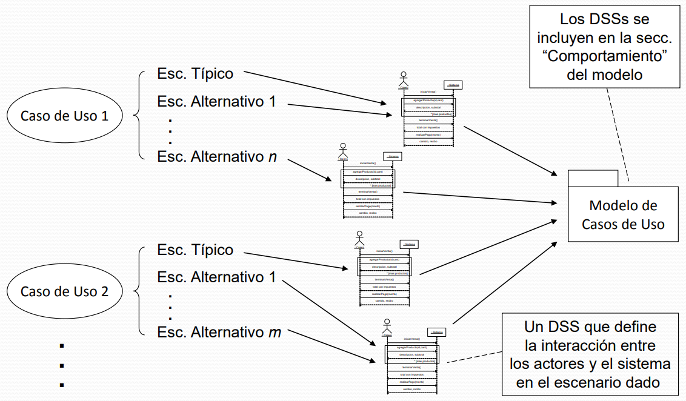

# Diapositivas #6 - 04/04/2025

## Especificación del comportamiento del sistema

### Introducción

- Durante esta actividad de análisis se busca describir en forma precisa cuál debe ser el comportamiento esperado del sistema.
- Se trabaja sobre el modelo de casos de uso:
    - Viendo al sistema como una unidad
    - Se definen protocolos que caractericen el uso del sistema por parte de los actores en cada escenario de los casos de uso.
    - El comportamiento completo del sistema es específicado al especificar cada mensaje de los protocolos.
- Cada escenario de los casos de uso a analizar es entendido en términos de una interacción entre los actores involucrados y el sistema.
- Al describir el significado de cada uno de los mensajes identificados en cada interacción se está especificando el comportamiento del sistema.
- Nos enfocamos en que es lo que debe hacer el sistema ante cada mensaje.
- La forma en como el sistema resuelve internamente un mensaje será definida durante la etapa de diseño.

### Modelo de casos de uso

- Contenido:
    - Introducción:
        - Breve descripción textual que sirve como introducción al modelo
    - Relevamiento de funcionalidades:
        - Descripción textual de información no reflejada en el resto del modelo, por ejemplo:
            - Secuencias típicas en que los casos de uso son utilizados por los usuarios
            - Otras funcionalidades no reflejadas en los casos de uso
    - Actores:
        - Todos los actores detectados por el sistema
    - Casos de uso:
        - Todos los casos de uso definidos
    - Relaciones:
        - Todas las asociaciones entre actores y casos de uso
    - Comportamiento:
        - Especificación del comportamiento de cada caso de uso en el modelo, el cual está definido por: Eventos del Sistema y Contratos de Software

#### La clase Sistema

- Durante esta actividad el sistema será considerado como un objeto:
    - Que es instancia de una clase Sistema
    - Que tiene operaciones (puede recibir mensajes)
    - Que tiene un estado
- En todo modelo de casos de uso se asume que existe una clase Sistema
- Existe una única instancia de la clase la cual representa al "sistema entero"
- Las operaciones de esta clase permiten que el sistema reciba mensajes de los actores:
    - Se identifican al definir los protocolos de los diferentes casos de uso
    - Durante el análisis no se busca diseñarlas
    - Su semántica es definida en términos del efecto que deben tener sobre el estado del sistema
- Un actor puede enviar mensajes al sistema "invocando" sus operaciones.

- En esta actividad el estado del sistema se asume como una configuración de objetos válida respecto al modelo de dominio.

### Interacciones con el sistema

- Los casos de uso describen la forma en que actores utilizan al sistema para cumplir con sus objetivos.
- Es necesario expresar estas ideas desde un punto de vista técnico
- Para ello se definen protocolos que determinan la interacción entre los actores y el sistema, ya sea para uno o varios escenarios de un caso de uso.
    - Cada protocolo es expresado mediante un Diagrama de Secuencia (DSS)

#### Eventos del sistema

- Un evento del sistema:
    - Es un estímulo externo,
    - Es generado por un actor,
    - Ante el cual el sistema debe reaccionar,
- Los acciones de los actores (sobre el sistema) descritas en los casos de uso sugieren los eventos del sistema.
- Es necesario considerar la definición del evento del sistema para identificarlos.
- Ejemplo:
    - "El usuario ingresa el nombre de la canción y el año":
        - Esto es un estímulo externo generado por un actor ante el cual el sistema debe reaccionar
        - Entonces **es un evento del sistema**
    - "El usuario inicia sesión en el sistema operativo":
        - Esto es un estímulo externo generado por un actor, pero no afecta al sistema
        - Entonces **NO es un evento del sistema**

#### Operaciones del sistema

- Los eventos del sistema disparan una operación del sistema.
- Estas operaciones son ejecutadas por la "instancia Sistema" en respuesta a la ocurrencia de un evento del sistema.
- Las operaciones del sistema relativas a una o varios escenarios de un caso de uso permiten definir la interacción entre los actores y el sistema.
- Las operaciones del sistema pueden tener asociados parámetros, por ejemplo:
    - "El usuario ingresa con el teclado el cuerpo y el asunto del email" representa un evento del sistema que dispara la operación:
        - **escribirEmail(cuerpo:String, asunto:String)**
    - "El usuario selecciona varios contactos de una lista desplegable" representa un evento del sistema que dispara la operación:
        - **elegirContactos(contactos:Set\<String\>)**

#### Diagrama de secuencia del sistema

- Es un artefacto incluido en el modelo de casos de uso que define e ilustra la interacción entre los actores y el sistema en uno o varios escenarios de una caso de uso.
- Incluye:
    - Una instancia representando a cada participante (sistema y actores)
    - Los mensajes enviados entre ellos en el/los escenario/s correspondiente/s (con sus respuestas)
- Un diagrama de secuencia del sistema puede ser construido para:
    - Un escenario de un caso de uso
    - Varios escenarios de un caso de uso
- Un criterio para decidir entre estas alternativas será la complejidad de estos escenarios y la simplicidad (o no) del DSS (Diagrama de Secuencia del Sistema) resultante.
- Los DSS definen la conversación entre los actores y el sistema, enfocándose en los mensajes que el sistema recibe.
- Sería posible incluir además mensajes enviados desde el sistema hacia los autores:
    - Sin embargo esto no forma parte del conjunto de servicios que el sistema brinda (y cuya especificación es el objetivo de esta actividad)
- Notación:

    

- Con respecto al tipo de un atributo (o tipo de retorno), cuando no es simple, sino que es una colección de un cierto Data Type **Tipo**. Puede utilizarse **Set(Tipo)**, si se quiere pasar como parámetro (o retorno) varios elementos de un solo tipo (por ejemplo: una lista de elementos)
    - **listarCanciones():Set(DataCancion)**

    

#### Sugerencias

- Definición de un DSS:
    1. Incluir una instancia que represente al sistema como una unidad
    2. Identificar cada actor que participe en el/los escenario/s considerado/s e incluir una instancia para cada uno
    3. De la descripción del caso de uso identificar aquellos eventos que los actores generen y sean de interés para el sistema e incluir cada uno de ellos como un mensaje
- Límite del sistema:
    - Para identificar eventos del sistema es útil pensar en el límite del sistema
    - El límite suele determinarse para que coincida con el sistema de software (y el de hardware también)
    - Buscar aquello que ocurra fuera de ese límite y que además lo atraviese
    - Es responsabilidad del sistema reaccionar ante el evento X?
    - Es X externo?
    - Las operaciones del sistema deberían retornar exclusivamente datatypes o tipos primitivos
- Memoria del sistema:
    - El sistema puede o no tener memoria:
        - Sin memoria, los mensajes son independientes
        - Con memoria, cada mensaje puede "recordar" la información utilizada en un estado previo del sistema
    - Debe indicarse claramente si el sistema tiene o no memoria, y en caso de tenerla, que información recuerda
    - Para indicar la memoria de un sistema, generalmente basta con indicarlo en el nombre del diagrama y mediante la utilización de notas en el diagrama
    - Alternativamente, puede utilizarse un diagrama de estructura estática en aquellos cases en que interese indicar una estructura compleja de dicha memoria
    - Veamos dos ejemplos:
        
        
    
#### Errores comunes

- Envío de mensajes hacia el usuario.
- Desconocer la memoria del sistema.
- No especificar Data Types utilizados.
- Sobrecargar de información un DSS pudiendo realizar varios de ellos.
- No indicar tipos de parámetros ni valor de retorno de los mensajes.

### Contratos de software

- Un contrato de software especifica el comportamiento o efecto de una operación.
- La especificación es declarativa y no imperativa.
- Esta técnica está basada en las ternas de Hoare en las que:
    - Se describen propiedades del resultado, en lugar de dar un conjunto de pasos o instrucciones que indiquen cómo calcularlo.
- El consumidor se compromete a satisfacer la precondición al invocar la operación:
    - Si la satisface: tiene derecho a exigir que la postcondición se satisfaga.
    - Si no la satisface: no se le garantiza la ejecución de la invocación (se lanzan excepciones).
- Por esta razón, es responsabilidad del consumidor saber cuando invocar la operación (y manejar en forma adecuada el resultado).
- El proveedor se compromete a satisfacer la postcondición solamente cuando la precondición fue satisfecha al momento de la invocación.
- El compromiso no comprende el caso en que la precondición no fue satisfecha.
    - En ese caso el proveedor puede devolver un valor arbitrario y el consumidor tiene que aceptarlo y saber que hacer con él.
- El consumidor:
    - Prefiere precondiciones débiles, porque implica menos trabajo
    - Prefiere postcondiciones fuertes, porque implica mejores resultados
- El proveedor:
    - Prefiere precondiciones fuertes, porque implica menos preocupaciones
    - Prefiere postcondiciones débiles, porque implica menos trabajo
- Precondición:
    - Es a lo que debe acceder el consumidor para obtener el resultado deseado
    - Es lo que debe exigir el proveedor para llegar al resultado deseado
- Postcondición:
    - Es a lo que accederá el consumidor
    - Es a lo que se compromete el proveedor
- Tanto las precondiciones como las postcondiciones son determinadas por el proveedor.
- El consumidor:
    - Viendo la postcondición, sabe que va a obtener, sin saber como
    - Viendo la precondición, sabe a cambio de que va a obtener el resultado deseado

#### Contratos de operaciones

- Los contratos se pueden realizar para operaciones de cualquier tipo de clase.
- En esta actividad las realizaremos para operaciones del sistema.
- Para una operación X tendremos {P}S{Q}:
    - P es la precondición de X (específicada)
    - S es el programa que implementa X (a ser diseñado más adelante en la etapa de diseño)
    - Q es la postcondición de X (específicada)
- Quién utiliza el contrato (partes P y Q) de una operacion?
    - Un diseñador de nuestro equipo que deba diseñar S
        - Para saber que es lo que tiene que lograr su diseño de la operación
        - En función de lo anterior para decidir como será el diseño de la operación (parte S)
    - Un desarrollador de otro equipo que deba invocar la operación (el diseño o implementación de S no es su responsabilidad)
        - Para saber que es lo que la operación hace sin tener que ver el diseño o la implementación de S

#### Condiciones

- En que términos se expresan las precondiciones y postcondiciones? Y para el caso particular de las operaciones del sistema?
- En términos generales estas condiciones refieren al estado del sistema antes y después de la invocación de la operación.
- En el caso de las operaciones del sistema, estas condiciones refieren al estado del sistema antes y después de la invocación de la operación.
    - Las precondiciones refieren además a los argumentos de la operación
    - Las postcondiciones refieren además al valor retornado por la operación (si existe)
- Las precondiciones refieren al momento previo a la invocación y expresan condiciones sobre:
    - Los valores de los parámetros de la operación
    - El estado del sistema:
        - La creación de objetos
        - La destrucción de objetos
        - La conexión de objetos
        - La desconexión de objetos
        - La modificación del valor de atributos de objetos
- Las postcondiciones refieren al momento posterior a la invocación y expresan condiciones sobre:
    - El valor de retorno (si corresponde)
    - El estado del sistema:
        - La creación de objetos
        - La destrucción de objetos
        - La conexión de objetos
        - La desconexión de objetos
        - La modificación del valor de atributos de objetos
- Creación de objetos:
    - **PRE:** Declarar que el objeto no existe
    - **POST:** Declarar que el objeto existe
- Destrucción de objetos:
    - **PRE:** Declarar que el objeto existe
    - **POST:** Declarar que el objeto no existe y que todos los objetos que estaban conectados a él ya no lo están
- Conexión de objetos:
    - **PRE:** Declarar que los objetos no están conectados
    - **POST:** Declarar que los objetos están conectados
- Desconexión de objetos:
    - **PRE:** Declarar que los objetos están conectados
    - **POST:** Declarar que los objetos no están conectados
- Modificación del valor de atributos de objetos:
    - **PRE:** Declarar que el objeto exista
    - **POST:** Declarar que el atributo del objeto tiene el valor dado
- Ejemplo para operación **crearCancion(nombreCancion:string, nombreArtista:string)**
    - Precondición: No existe un objeto Canción de nombre "nombreCancion" en el sistema
    - Precondición: Existe un objeto Artista de nombre "nombreArtista"
    - Postcondición: Se crea una nueva instancia de Cancion de nombre "nombreCancion" con atributo "id" autogenerado tal que "id" sea único en el sistema

#### Estructura de contratos

- Un contrato es un artefacto textual que se incluye en la sección "Comportamiento" del modelo de casos de uso.
- Está estructurado de la siguiente forma:
    - **Firma:** Cabezal sintáctico de la operación
    - **Parámetros:** Descripción de los parámetros de la operación
    - **Responsabilidades:** Descripción de las responsabilidades, una idea de lo que debe realizar la operación
    - **Referencias cruzadas:** Casos de uso a los que pertenece la operación
    - **Salida:** Resultado de la operación (solo si es una función)
    - **Precondición:** Descripción del estado de la instancia del sistema a la que se le aplicará la operación, y otras condiciones que sea necesario asumir previo a la aplicación (por ejemplo, con respecto a los parámetros)
    - **Postcondición:** Descripción del estado de la instancia del sistema a la que se aplicó la operación
    - **Snapshots:** (Opcional)
        - Pares de snapshots que ejemplifiquen el estado de la instancia a la que se le aplicó la invocación, previo y posterior a la invocación
        - La invocación concreta que produce el cambio ejemplificado (mostrando los parámetros efectivos)

#### Errores comunes

- Incluir invariantes como postcondiciones
- Omitir el resultado de una operación como postcondición
