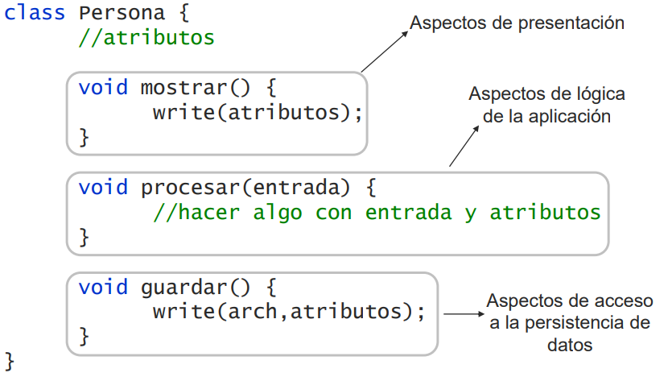
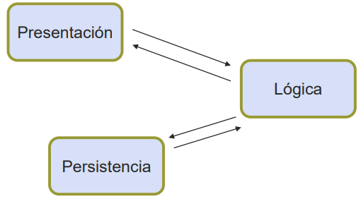
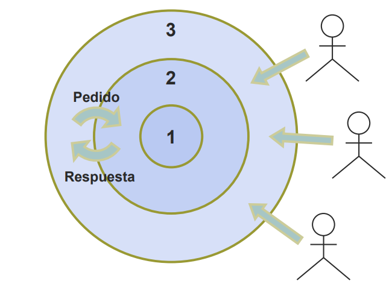
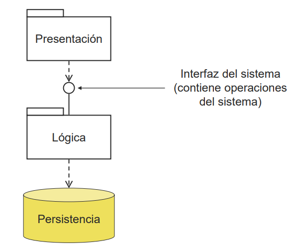
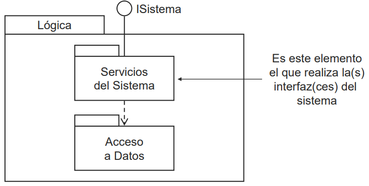
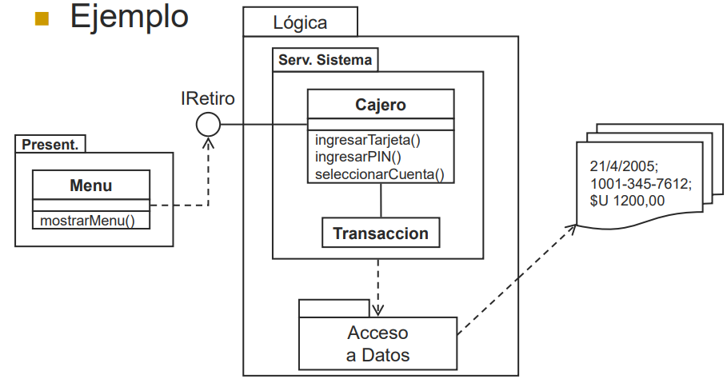
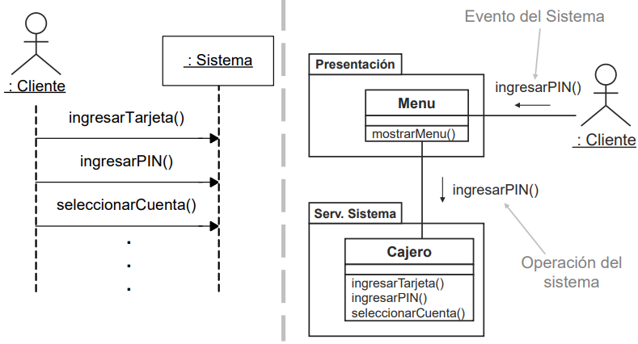
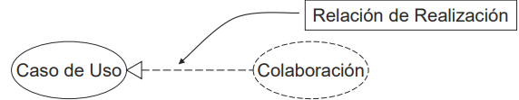

# Diapositivas #9 - 13/05/2025

## Diseño

### Introducción

- Durante el análisis, un caso de uso fue reformulado en términos de interacciones entre los actores y el sistema (DSS).
- El efecto de cada mensaje fue especificado de forma precisa (Contrato).
- Es el momento de definir **cómo** hace el sistema internamente para resolver cada una de las operaciones del sistema.
- La arquitectura de software busca expresar la estructura global de una aplicación.
- El nivel de abstracción empleado para expresar dicha estructura es mayor que el empleado para detallar la solución al problema de software planteado.
- El objetivo de la arquitectura no es detallar la solución adoptada, sino que proveer una visión global de la misma para simplificar su comprensión.
- Uno de los puntos de vista desde donde se suele estudiar la estructura de una aplicación es la **estructura interna**.
- La arquitectura desde este punto de vista se denomina **arquitectura lógica**.
- A definir cómo se resuelven las operaciones del sistema en esta estructura se le llama **diseño de bajo nivel** (o simplemente **diseño**).

### Objetivos

- Definir la estructura interna del sistema a construir.
- Realizar el diseño de las operaciones del sistema.

### Arquitectura lógica

- La arquitectura lógica se define como un conjunto de componentes lógicos relacionados entre si, con responsabilidades específicas.
- Estos componentes se obtienen a partir de la sucesiva partición del sistema en componentes con responsabilidades más concretas (enfoque top-down).
- Existen **guías** de particionamiento.
- Cada una de ellas propone:
    - Un tipo de asignación particular
    - Asignación de responsabilidades a los componentes resultantes
- Se denominan estilos o patrones de arquitectura
- La elección del estilo a aplicar depende del sistema que se esté construyendo.

#### Aspectos de una aplicación

- El diseño de un sistema de software comprende la resolución de múltiples aspectos de una aplicación.
- La forma en la que esos aspectos sean resueltos determina la flexibilidad del diseño.
- Desde un punto de vista lógico, es preferible separar el diseño de aspectos diferentes para:
    - Permitir que evolucionen independientemente
    - Simplificar el problema y tener mejor visibilidad de las partes que componenen la aplicación
- Diseñar e implementar en forma conjunta diferentes aspectos:
    - Usualmente simplifica la arquitectura, pero
    - Complica el diseño
- La separación de aspectos generalmente:
    - Complica la arquitectura (estructura general)
    - Simplifica el diseño de cada uno al permitir enfocarse sobre cada uno por separado.



- En el ejemplo anterior se detectan fragmentos de código con diferentes propósitos en una misma clase.
    - Código para procesar la información existente que implementa la lógica de la aplicación,
    - Código de interacción con el usuario, y
    - Código que sirve para almacenar los datos en un medio persistente
- Esto es común a la mayoría de los sistemas de información interactivos.
- Se puede decir que estas aplicaciones abarcan básicamente tres aspectos.
    - **Presentación:** incluye todo lo referente a la interacción del sistema con los usuarios en el mundo exterior
    - **Lógica:** se encarga del procesamiento particular que el sistema debe realizar sobre la información que maneja
    - **Persistencia:** consiste en el almacenamiento persistente de dicha información

- Incluir los tres aspectos en una clase no resulta flexible.
- La clase completa queda dependiente de:
    - La forma en que los datos son mostrados u obtenidos del usuario, y además de
    - La forma en que los datos son almacenados
- Es deseable establecer una separación de dichos aspectos.
- Es decir, mantener el código referente a cada aspecto en clases separadas.
- Esto sugiere un criterio concreto de partición de componentes.

    

#### Arquitectura en capas

- Una arquitectura en capas es la arquitectura de un sistema que haya sido particionado según el estilo de capas.
    - Define diferentes "niveles" de elementos
    - Los elementos de un mismo nivel tienen responsabilidades de abstracción similar
    - Los elementos de un nivel están para atender los pedidos del nivel superior

    

- La partición definida anteriormente es compatible con el estilo de capas.
- Se pueden definir las capas:
    - Presentación
    - Lógica
    - Persistencia
- Los actores solamente utilizan la capa de presentación
- La capa de persistencia no requiere de los servicios de ningún otra.

    

- Qué hay en cada capa?
    - **Presentación:** clases que se encargan de capturar la entrada de los usuarios y mostrar información
    - **Lógica:**
        - Clases que describen los objetos que procesarán la información para satisfacer los casos de uso del sistema
        - Clases que permiten a las anteriores acceder a los datos
    - **Persistencia:** datos del sistema que necesiten ser preservados (texto plano, base de datos, etc.)

- Usualmente la capa lógica es refinada de la siguiente manera:

    

    

#### Operaciones del sistema

- Los diagramas de secuencia del sistema ilustran la forma en que los actores realizan las "invocaciones" sobre el sistema.
- Al estudiar la arquitectura lógica es posible profundizar en los detalles de como se realizan dichas invocaciones.

    

##### Implementación de ejemplo

Veamos un ejemplo de implementación de este esquema para entender mejor el tema:

```cpp
// pertenece en forma lógica a la capa de presentación
class Menu {
    IRetiro atm;

    void mostrarMenu() {
        // leer en t el número de tarjeta
        atm.ingresarTarjeta(t);
        // leer en p el PIN
        atm.ingresarPIN(p);
        // leer en c el número de cuenta
        atm.seleccionarCuenta(c);
        // continua...
    }
}

// pertenecen en fórma lógica a la capa lógica
interface IRetiro {
    void ingresarTarjeta();
    void ingresarPIN();
    void seleccionarCuenta();
}

class Cajero realize IRetiro {
    public void ingresarTarjeta() {...};
    public void ingresarPIN() {...};
    public void seleccionarCuenta() {...};
    // continua...
}
```

### Diseño de bajo nivel

- Tenemos definida la estructura interna del sistema a construir (arquitectura lógica).
- A partir de dicha estructura definimos **como** se resuelven internamente cada una de las operaciones del sistema.
- En este curso, el diseño de bajo nivel estará enfocado en la capa lógica.
- Esta información compondrá lo que llamaremos **modelo de diseño**.

#### Objetivos

- Diseñar colaboraciones que realicen los casos de uso del sistema.
    - Se busca diseñar una colaboración por cada caso de uso (o varios de ellos juntos)
    - Una colaboración realiza un conjunto de casos de uso cuando define su solución.
    - Esta relación es la misma que se puede definir entre una interfaz y un conjunto de clases.

    

#### Colaboración

- Una colaboración está compuesta por:
    - Una **estructura:** que indica
        - Las clases de objetos que participan en la solución de los casos de uso
        - Los atributos de las mismas y sus relaciones
        - Las operaciones que pueden ser invocadas sobre sus instancias
    - **Interacciones:** que definen la forma en que objetos de las clases dadas se comunican para obtener el resultado deseado.
- La estructura de la colaboración indica **quién** participa y sus propiedades.
- Las interacciones de la colaboración indica **como** los participantes logran el resultado.
- Por lo tanto una colaboración que realice un conjunto de casos de uso contendrá:
    - La estructura de los participantes
    - Una interacción en términos de dichos participantes **para cada operación del sistema**
        - En cada interacción se detalla la forma en que cada operación es resuelta
- Existen dos enfoques para diseñar una colaboración:
    - Definir primero la estructura y luego generar las diferentes interacciones "respetándola"
    - Definir "libremente" las interacciones y luego definir la estructura necesaria para que éstas puedan ocurrir
- En el curso seguimos el segundo enfoque.
- Para lograr los objetivos planteados, realizaremos las siguientes actividades:
    - Diseño de interacciones
    - Diseño de la estructura

##### Diseño de interacciones

- Consiste en definir comunicaciones entre objetos que permitan resolver operaciones del sistema.
- Esta definición se realiza "libremente".
    - Los protagonistas aparecen sugeridos en el **modelo de dominio**
    - El resultado es el específicado en el contrato de la operación del sistema a diseñar
- La libertad está dada en los mensajes que los protagonistas se puedan enviar entre si.
- Herramienta: **diagrama de comunicación**

##### Diseño de la estructura

- Consiste en especificar completamente la estructura necesaria para que todas las interacciones puedan ocurrir
    - Se busca especificar la estructura de una colaboración
    - Por lo tanto es necesario considerar todas las interacciones del caso de uso que la colaboración realiza
    - Recordar que se define una interacción por cada operación del sistema
    - Herramienta: **diagrama de clases de diseño**

##### Consideraciones

- Durante la etapa de diseño de una metodología iterativa e incremental se obtienen un conjunto de colaboraciones que comprenden todos los casos de uso del sistema.
- En consecuencia, se obtiene un diagrama de comunicación por operación del sistema y un conjunto de DCDs, uno por colaboración.
- Los DCDs pueden requerir algún tipo de revisión de alguien con una visión global de la solución a los efectos de eliminar inconsistencias.
- Durante el diseño la idea clave es la asignación de responsabilidades.
- La asignación de responsabilidades, se realiza (en parte) **definiendo operaciones** para los participantes de la solución.
- Es posible definir diferentes interacciones para lograr un mismo efecto.
- Esto es asignando responsabilidades de maneras diferentes.
- A pesar de que pueden existir varias soluciones, no todas tienen las mismas cualidades (flexibilidad, extensibilidad, adaptabilidad, etc.).
- Buscaremos encontrar soluciones que además presenten buenas cualidades.
- Para ello utilizaremos criterios de asignación de responsabilidades.
- Estos criterios buscan evitar la toma de malas decisiones al momento de asignar responsabilidades.